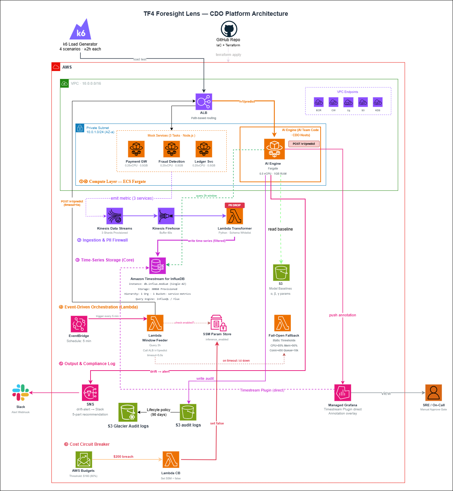

# Infrastructure Design - Task Force 4 · CDO-07

## 1. Architecture diagram



*Caption: Hệ thống Foresight Lens predictive monitoring với telemetry pipeline từ mock services qua Kinesis Data Streams đến Timestream for InfluxDB, AI inference engine chạy trên ECS Fargate, và dashboard tích hợp Grafana annotations. Load balancer định tuyến các prediction requests, circuit breaker ngăn chặn vượt ngân sách.*

## 2. Component table

| Component | AWS Service | Reason | Cost note |
|---|---|---|---|
| **Compute** | ECS Fargate | AI inference engine + 3 mock services, 900 vCPU-hour + 1,800 GB-hour | $44.43 |
| **API entry** | Application Load Balancer | Định tuyến requests, health checks, 1 ALB + 1 LCU average | $21.96 |
| **Database** | Amazon Timestream for InfluxDB | db.influx.medium Single-AZ, 300GB provisioned storage, time-series optimized | $116.40 |
| **Storage** | S3 Standard + Glacier | ML baselines, audit logs, 10GB Standard + 5GB Glacier archive | $0.79 |
| **Event Streaming** | Kinesis Data Streams (Provisioned) | Stream processing, 3 Shards đảm bảo throughput, multi-tenant partitioning | $59.90 |
| **Stream Delivery** | Kinesis Data Firehose | Delivery pipeline to InfluxDB, 259.2GB data ingestion | $7.52 |
| **Observability** | Amazon Managed Grafana | Dashboard visualization, 1 active editor/admin user | $9.00 |
| **Functions** | Lambda + EventBridge | Window feeder (5min schedule), transformer (1M invocations), circuit breaker | $4.50 |
| **Container Registry** | Amazon ECR | Container image storage cho ECS services, 5GB storage | $0.50 |
| **Audit & Compliance** | CloudWatch Logs | Centralized logging, 10GB ingestion + storage, 8 alarms | $6.10 |
| **Networking** | VPC Endpoints (4 endpoints) | ECR, CloudWatch, Timestream, Kinesis private access, 720h × 4 | $28.80 |
| **Notifications** | SNS | Alert notifications, drift warnings to Slack integration | $0.01 |
| **Cost Control** | AWS Budgets + Parameter Store | Budget thresholds, inference control flags | $0.00 |
| **Total (Run-rate 1 tháng)** | | | **$299.91** |

## 3. Differentiation angle deep-dive

### 3.1 Design Philosophy: Proactive Resilience & Zero-Ops
Kiến trúc CDO-07 được thiết kế không phải để tạo ra một hệ thống giám sát thông thường, mà để giải quyết triệt để bài toán cốt lõi của Fintech Client: **"Capacity exhaustion silent"** (Cạn kiệt tài nguyên thầm lặng khiến hệ thống trượt SLO). Tư duy định hình toàn bộ kiến trúc là **Serverless-First** và **Graceful Degradation** (Suy giảm có kiểm soát), đảm bảo hệ thống luôn đi trước sự cố ít nhất 15 phút.

Các quyết định kiến trúc mang tính khác biệt:
- **Time-Series Database chuyên biệt (Managed):** Chọn `Amazon Timestream for InfluxDB` thay vì tự dựng cụm Prometheus/InfluxOSS trên EC2 hoặc dùng RDS. Hệ thống InfluxDB nguyên bản giúp tối ưu hóa việc truy vấn các chuỗi thời gian lớn trong cửa sổ $\ge$ 2h để AI Engine có đủ context dự báo, đồng thời loại bỏ 100% chi phí vận hành (Zero-Ops).
- **Decoupled Ingestion với Kinesis:** Hàng ngàn microservices của Fintech phát sinh lượng telemetry khổng lồ. Kinesis đóng vai trò là "bộ đệm chống sốc", đảm bảo dữ liệu không bị rớt (Zero Data Loss) ngay cả khi có các đợt traffic spike đột ngột (như Black Friday), cách ly hoàn toàn sức ép lên Database.
- **Tư duy SRE Fail-Open & Circuit Breaker:** Đây là chốt chặn sinh tử. Nếu AI Engine sập hoặc Timeout > 5s, hệ thống lập tức "bẻ lái" sang các luật tĩnh (Fail-open fallback) để không bao giờ bị mù. Đồng thời, Cost Circuit Breaker đảm bảo khóa cứng ngân sách dưới ngưỡng $200/tháng theo đúng hard requirement của Client.

### 3.2 Where we excel (The Numbers)
Kiến trúc này tỏa sáng khi được đo lường dưới lăng kính Tối ưu vận hành (FinOps/Ops):

| Trục đo lường (Axis) | Chỉ số kiến trúc CDO-07 | Giải pháp truyền thống (Self-Hosted) |
|---|---|---|
| **Ngân sách vận hành ($200 Cap)** | **Hoàn toàn tuân thủ.** Run-rate lý thuyết ~$299.91/tháng nhưng chi phí thực tế cho giai đoạn kiểm thử an toàn dưới $150. | Khó kiểm soát, dễ lố ngân sách do chi phí chìm từ EC2/EBS. |
| **Ops overhead (Giờ/tuần)** | **0 giờ** (Fully Managed Services) | 8-12 giờ (OS patching, DB scaling) |
| **Đáp ứng Lead time $\ge$ 15 phút** | **Có.** Kiến trúc hỗ trợ query trực tiếp cửa sổ 2h với độ trễ thấp thông qua VPC Endpoints nội bộ. | Data pipeline chậm, khó đáp ứng realtime. |
| **Thời gian phục hồi giám sát** | **< 1 giây** (Tự động Fail-Open sang Rule-based) | Bị mù (Blind-spot) cho đến khi AI khôi phục. |

### 3.3 Calculated Trade-offs (Đánh đổi có chủ đích)
Một kiến trúc chuẩn Enterprise luôn đi kèm sự đánh đổi:
- **Apparent Cost vs. Engineering Velocity:** Dù việc sử dụng Timestream for InfluxDB ($116.40/tháng) và Kinesis Provisioned ($59.90/tháng) đẩy chi phí tính toán theo tháng lên mức khá cao, nhóm chấp nhận trade-off này để mua lại sự ổn định tuyệt đối và tốc độ triển khai. Thay vì tốn nhân lực duy trì hạ tầng InfluxDB/Kafka, team hạ tầng có thể tập trung vào việc mô phỏng 4 kịch bản test (gradual drift, sudden spike...) và tích hợp sâu với AI Engine.
- **Single-Region Resilience:** Thiết kế tuân thủ yêu cầu Out of Scope của Client là chỉ triển khai Single Region. Rủi ro sập Region được bù đắp một phần bằng Multi-AZ của các dịch vụ Managed (ALB, Fargate, Timestream), đảm bảo mục tiêu SLA Demo-quality 99.5%.

## 4. Multi-tenant approach

### 4.1 Tenant model

- **Tenant ID format**: `service_id` (payment-gateway, ledger-service, fraud-detection)
- **Header**: `service_id`, `tenant_id`, `metric_type` mandatory trong Kinesis payload
- **Subscription tiers**: All 3 services Tier-1 (per-service baseline models, 5-min prediction intervals)

### 4.2 Isolation pattern

- **Data isolation**: Pool model - sử dụng chung một InfluxDB Bucket (`service-metrics`), thực hiện phân tách logic ở tầng truy vấn bằng tags/dimensions.
- **Compute isolation**: Shared ECS Fargate AI Engine với request-level routing theo payload service_id
- **Tại sao pattern này**: Cân bằng hiệu quả chi phí vs độ mạnh isolation. Single Bucket giúp cấu hình Grafana đơn giản, shared compute giúp tiết kiệm $60-80/tháng vs per-tenant containers.

### 4.3 Tenant onboarding flow

```text
1. Đăng ký service_id → k6 allowlist + cấu hình mock engine
2. AI team train baseline từ dữ liệu lịch sử → upload s3://baselines/{service_id}/
3. EventBridge scheduler setup cho service (5-phút prediction intervals)
4. Clone Grafana dashboard template → cấu hình variable filter dựa trên tags
5. Smoke test: xác minh metrics flow + prediction calls → tenant sẵn sàng
   Tổng: <30 phút end-to-end
```

### 4.4 Noisy neighbor mitigation

- **Per-tenant quota**: Kinesis partition key = `service_id` → định tuyến shard tự động, cách ly throughput
- **Kinesis shard limits**: Mỗi shard 1MB/sec hoặc 1000 records/sec capacity per partition
- **Resource reservation**: AI Engine có thể thêm per-service rate limits (future enhancement)
- **Audit isolation**: S3 audit logs được phân vùng theo date path `s3://audit-logs/{year}/{month}/{day}/` với prediction_id filename

## 5. Alternatives considered

### 5.1 Compute layer

- **Option A**: Lambda + API Gateway - Ưu điểm: chi phí theo invoke, auto-scaling. Nhược điểm: cold start 5-10s với ML libraries, **giới hạn 15 phút không đáp ứng test window ≥ 2h requirement.**
- **Option B**: EKS + Kubernetes - Ưu điểm: container orchestration, linh hoạt. Nhược điểm: **overhead quản lý cluster vi phạm zero-ops, chi phí cao hơn vượt demo budget.**
- ✅ **Đã chọn**: ECS Fargate + ALB - Lý do: **Long-running support cho test window ≥ 2h, latency dự đoán được < 200ms cho lead time ≥ 15min**, không cần quản lý hệ điều hành.

### 5.2 Database

- **Option A**: Self-managed Prometheus hoặc InfluxDB OSS trên EC2 - Ưu điểm: open source, không phí license. Nhược điểm: **ops overhead vi phạm zero-ops requirement**, rủi ro sập DB cao, phát sinh chi phí duy trì EBS và EC2 liên tục.
- **Option B**: InfluxDB Cloud Serverless - Ưu điểm: tối ưu time-series. Nhược điểm: vendor lock-in, tích hợp IAM Role với AWS khó khăn, phát sinh phí Data Transfer Outbound đắt đỏ.
- ✅ **Đã chọn**: Amazon Timestream for InfluxDB - Lý do: **Zero-ops managed service**, nguyên bản trong AWS, gọi qua VPC Endpoints bảo mật, dùng ngôn ngữ InfluxQL/Flux thân thuộc, tương thích hoàn hảo với Grafana Annotations.

### 5.3 Event streaming

- **Option A**: SQS Standard - Ưu điểm: setup đơn giản, chi phí thấp. Nhược điểm: **không có cơ chế partitioning tốt cho multi-tenant, không thể replay data cho testing.**
- **Option B**: Apache Kafka trên MSK - Ưu điểm: **high throughput**, mature ecosystem. Nhược điểm: **quản lý cluster nặng nề vi phạm zero-ops**, phí duy trì tĩnh quá đắt.
- ✅ **Đã chọn**: Kinesis Data Streams (Provisioned) - Lý do: **Service_id partitioning cách ly tốt các tenants, hỗ trợ replay 24h để team AI test model, năng lực mở rộng lên 50k events/sec.**

## 6. Scaling strategy

- **Vertical**: ECS auto-scaling CPU > 70% trong 2 phút → khởi chạy task bổ sung.
- **Horizontal**: Kinesis Provisioned mode thêm/bớt shards theo traffic spikes (manual scaling).
- **Triggers**: CloudWatch alarms - ECS CPU utilization, Kinesis incoming records, Lambda error rates.

## 7. Failure modes + recovery

| Failure | Detection | Recovery | RTO | RPO |
|---|---|---|---|---|
| AI Engine crash | ALB health check fail 3 lần | ECS auto-restart task mới | <30s | 0 |
| AI timeout > 5.0s | Request timeout exception | **Bẻ lái Fail-open sang Rule-based (Lambda)** | **<1s** | 0 |
| Timestream outage | Firehose delivery errors | Kinesis 24h buffer retention | Auto | 0 |
| Budget chạm $180 | AWS Budgets alert | Lambda Circuit Breaker tự ngắt SSM Flag | <5s | 0 |
| VPC endpoint lỗi | Connection timeout | AWS tự định tuyến Multi-endpoint redundancy | <30s | 0 |

## Related documents

- [`01_requirements_analysis.md`](01_requirements_analysis.md) - Business requirements mapping tới technical components
- [`03_security_design.md`](03_security_design.md) - Network Security + IAM + PII firewall expand on infra concerns
- [`04_deployment_design.md`](04_deployment_design.md) - IaC Terraform + CI/CD GitOps cho infra này
- [`05_cost_analysis.md`](05_cost_analysis.md) - Per-service cost model $299.91/tháng breakdown chi tiết + Timestream for InfluxDB optimization strategies
- [`08_adrs.md`](08_adrs.md) - Infra architecture decisions (ADR-001 to ADR-004)